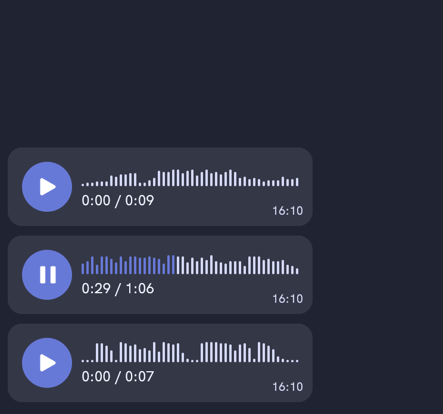

# React-Voicemail-Player

The audio player control for React that displays the audio's amplitude peaks. Loads and decodes the audio data in memory, so best suited for small audio files, like voicemail, hence the name. The use case I had in mind is chat-based apps where users can send voice messages. Inspired by audio player in the Telegram messenger.



Note, this is neither a powerful audio visualization library, nor a powerful audio player. If you need rich visualizations, I suggest [wavesurfer.js](https://wavesurfer-js.org/). If you look for a general-purpose audio player, check out [react-audio-player-pro](https://webbestmaster.github.io/react-audio-player-pro/).

Check out the [demo app](https://local-longhaired-liquid.glitch.me/).

## Installation

Requires `react` to be already installed in your project. Minimum supported version of React is 18 because this component uses [`useSyncExternalStore`](https://react.dev/reference/react/useSyncExternalStore) hook. There is a [shim](https://www.npmjs.com/package/use-sync-external-store) for that, so it might be added in the future to support earlier versions of `react` if needed.

```
npm i react-voicemail-player

# or

yarn add react-voicemail-player
```

## Usage

First you need to make sure the component's CSS is included on your web page. How you do this depends on your environment. Most probably you can import the stylesheet directly in your JavaScript or your CSS files:

```
// App.tsx
import 'react-voicemail-player/dist/react-voicemail-player.css';
```

```
// styles.css
@import url('react-voicemail-player/dist/react-voicemail-player.css')
```

Then, you import and render the component as you normally would. It accepts a function as `children` (render prop) that renders an `<audio>` element. The function will be called with a `RefCallback` as an argument that you need to set as `ref` on the rendered `<audio>` element.

```javascript
import VoicemailPlayer from "react-voicemail-player";

function YourComponent() {
  return (
    <VoicemailPlayer>
      {(ref) => <audio ref={ref} src="https://example.com/audio.mp3" />}
    </VoicemailPlayer>
  );
}
```

Since you have full control over the `<audio>` element, you can implement whatever functionality is missing from this player yourself by setting attributes/properties or calling methods on the element. Relevant changes to the `<audio>` element will be automatically reflected in the player's state. See examples setting the `mute` attribute dynamically and controlling the playback rate in [./example/App.tsx](./example/App.tsx);

## API

Currently, the component only accepts two props:

- `children: (ref: React.RefCallback<HTMLAudioElement>) => React.ReactElement` - A function that renders the `<audio>` element and sets its `ref` prop
- `className: string` - A CSS class name to give to the component's root element

See the full [API Reference](./docs/api/index.md).

## Styling

Please consult the component's [stylesheet](./src/VoicemailPlayer.css) and [source code](./src/VoicemailPlayer.tsx) as necessary to determine which classes and properties you need to override.

## Development

Install dependencies with `yarn`:

```
yarn
```

Start development server

```
yarn start
```

Run tests (with watch mode)

```
yarn test
```

### E2E Tests

> E2E tests are run against the pre-compiled library files,
> make sure you've run `yarn build` before running e2e tests locally

Run once:

```
yarn test:e2e
```

Run in UI mode:

```
yarn test:e2e:ui
```

Update screenshots:

```
yarn test:e2e --update-snapshots
```

Update snapshots on Linux (for CI):

```
docker run --rm --network host -v $(pwd):/work/ -w /work/ -it mcr.microsoft.com/playwright:v1.37.0-jammy /bin/bash
yarn install
yarn test:e2e --update-snapshots
```
